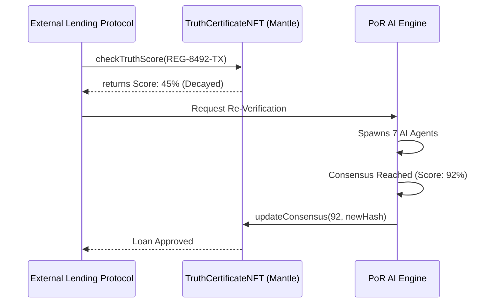

# Proof-of-Reality (PoR) Protocol

Proof-of-Reality (PoR) is a decentralized AI consensus protocol that verifies real-world assets using multi-agent intelligence before anchoring truth on-chain as verifiable certificates on Mantle.

> **An AI court system for real-world truth.**

---

## 🚨 The Problem

The tokenization of Real-World Assets (RWAs) is scaling rapidly, but the verification layer is fundamentally broken:
- **RWAs fail because truth is unverifiable:** Physical assets rely on trust, not math.
- **Oracles are centralized:** Current oracles rely on single-source data feeds.
- **AI lacks consensus:** AI agents today don’t agree—they guess independently in isolation.
- **No structured disagreement:** No system exists for structured AI debate and mathematical consensus.

---

## ⚡ The Aletheia Consensus Engine

PoR solves the verification problem through an intelligent, decentralized court.

- **Multi-agent verification:** 7 specialized AI agents analyze the asset concurrently.
- **Structured AI debate:** Agents challenge each other when anomalies arise.
- **Weighted consensus:** Final truth is derived via confidence and reputation scoring.
- **On-chain truth finality:** Consensus is minted immutably as a Mantle NFT certificate.

---

## 🏛️ System Architecture

Each asset is processed by a distributed AI intelligence network that independently verifies reality from multiple dimensions before converging into a single consensus state.

```mermaid
graph TD
    A[User Submits Asset Data] -->|Registry ID, Coords, Docs| B(Aletheia Consensus Engine)
    
    subgraph Parallel Intelligence Gathering
        B --> C[Atlas: Geo-Spatial]
        B --> D[Oracle: Financial]
        B --> E[Ledger: Title/Legal]
        B --> F[Prism: Fraud Detection]
        B --> G[Pulse: Social Sentiment]
        B --> H[Tempest: Climate Risk]
        B --> I[Sentinel: KYC/AML]
    end
    
    C -->|Geo Findings| J{Debate Chamber}
    D -->|Valuation Findings| J
    E -->|Ownership Findings| J
    F -->|Anomaly Reports| J
    G -->|Market Signals| J
    H -->|Risk Models| J
    I -->|Compliance Checks| J
    
    J -->|Contradictions Detected| K[Cross-Examination Phase]
    K -.->|Re-evaluate| Parallel Intelligence Gathering
    
    J -->|Mathematical Consensus| L[Evidence Hashed]
    
    L --> M[Smart Contract: TruthCertificateNFT]
    M -->|Mints to Mantle| N((Truth Certificate))
```

---

## 🧠 The AI Agent Squad

👉 **Each agent has independent memory + tool access + confidence scoring.**

| Agent | Domain | Function |
|-------|--------|----------|
| **Atlas** | Geo-Spatial | Analyzes physical boundaries and structural integrity. |
| **Ledger** | Legal/Title | Verifies deeds, ownership history, and active liens. |
| **Oracle** | Financial | Pulls comparable sales and projects market valuation. |
| **Prism** | Fraud | Scans document metadata for cryptographic forgery. |
| **Pulse** | Social | Analyzes neighborhood momentum and economic velocity. |
| **Tempest**| Climate | Models environmental hazards (flood, wildfire) for the asset. |
| **Sentinel**| Compliance | Checks OFAC sanctions and jurisdictional compliance. |

---

## ⚖️ The Debate-to-Truth Engine

The core innovation of PoR is how it processes conflicting intelligence.

- **Step 1: Parallel Reasoning.** All agents execute tools and generate confidence-weighted findings concurrently.
- **Step 2: Contradiction Detection.** The Master Node detects anomalies (e.g., Ledger confirms a deed, but Prism flags document forgery).
- **Step 3: Cross-Examination Loop.** Agents are forced to re-evaluate their findings based on detected contradictions.
- **Step 4: Weighted Consensus.** A mathematical truth score is calculated based on agent confidence and historical reputation.
- **Step 5: Cryptographic Finalization.** The debate log is compressed into an immutable **Evidence Hash (SHA-256)** for on-chain anchoring.

---

## 🔗 The On-Chain Layer (Mantle Network)

Once the AI engine reaches consensus, the truth is permanently recorded. 

The `TruthCertificateNFT.sol` smart contract is invoked to store:
1. The `assetId`
2. The `consensusScore`
3. The cryptographic `evidenceHash`

---

> [!IMPORTANT]  
> ## ⏳ Highlight: Dynamic Truth Decay
> 
> **Truth is not static. Reality changes.** 
> 
> A building can burn down; markets can crash. PoR implements a `decayTimer` mechanism:
> - The on-chain consensus score **decays over time**.
> - This decay triggers automated **re-verification**.
> - It enforces **continuous trust updates**, ensuring that a Truth Certificate is always an accurate reflection of the current reality.

---

## 🌍 Protocol Base-Layer Infrastructure (B2B)

Proof-of-Reality is designed as **Base-Layer Infrastructure** for the Real-World Asset (RWA) ecosystem. Other Web3 projects can compose on top of PoR:

1. **DeFi Lending:** Decentralized banks can query the PoR `consensusScore` before approving real-estate collateralized loans. If fraud is detected or the score has decayed, the loan is denied.
2. **RWA Tokenization:** Tokenization platforms can use PoR as an automated auditor before fractionalizing a physical asset.
3. **Decentralized Insurance:** Parametric protocols can use *Tempest* and *Atlas* outputs to automatically trigger payouts for property damage.



---

## 📜 Smart Contracts (Mantle Sepolia)

The protocol contracts are fully secured with Role-Based Access Control (RBAC) ensuring only the verified Agent Relayer can resolve cases and mint certificates.

| Contract | Address | Purpose |
|----------|---------|---------|
| **VerificationManager** | `0x34d156d6c062804771652b48f2d65d58d3794113` | Orchestrates the Verification Pipeline |
| **TruthCertificateNFT** | `0x86C41594e9aDeCcf8c85ba9EEe0138C7c9E70dBc` | Mints final Truth on-chain |
| **AgentRegistry** | *(Available upon governance vote)* | Manages Node Operator identities & reputations |

---

## 🛠️ Technology Stack

- **Frontend:** Next.js 16, React 19, TailwindCSS v4, Framer Motion, Wagmi, Viem.
- **Backend (AI Engine):** Python, FastAPI, LangGraph, LangChain, OpenAI (`gpt-4o-mini`).
- **Smart Contracts:** Solidity `^0.8.24`, Foundry, Mantle Sepolia.

## 🚀 Running Locally

### 1. The AI Backend
```bash
cd apps/api
# Add your OPENAI_API_KEY to .env
python3 -m venv venv
source venv/bin/activate
pip install -r requirements.txt
uvicorn main:app --reload --port 8000
```

### 2. The Mission Control UI
```bash
cd apps/web
pnpm install
pnpm run dev
```
Navigate to `http://localhost:3000/verify` to initialize the consensus engine.
