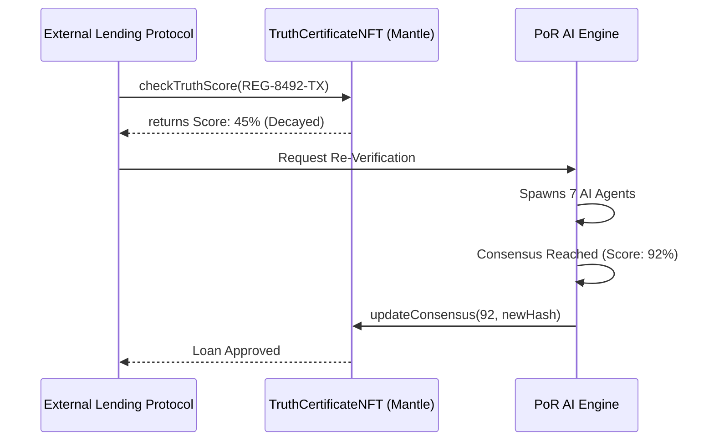

# Proof-of-Reality (PoR) Protocol
> **Decentralized AI consensus for verifying real-world truth.**

Proof-of-Reality (PoR) is an institutional-grade, multi-agent AI protocol built on the **Mantle Network**. It solves the "Oracle Problem" for Real-World Assets (RWA) by using a decentralized network of specialized AI agents to independently investigate, cross-examine, and cryptographically verify off-chain data before minting it on-chain as a **Truth Certificate NFT**.

---

## 🏛️ System Architecture

The PoR architecture is a complex state machine driven by **LangGraph** on the backend and **Solidity** on-chain. It is designed to act as a mission-critical intelligence pipeline.

```mermaid
graph TD
    A[User Submits Asset Data] -->|Registry ID, Coords, Docs| B(Aletheia Consensus Engine)
    
    subgraph Parallel Intelligence Gathering
        B --> C[Atlas: Geo-Spatial]
        B --> D[Oracle: Financial]
        B --> E[Ledger: Title/Legal]
        B --> F[Prism: Fraud Detection]
        B --> G[Pulse: Social Sentiment]
        B --> H[Tempest: Climate Risk]
        B --> I[Sentinel: KYC/AML]
    end
    
    C -->|Geo Findings| J{Debate Chamber}
    D -->|Valuation Findings| J
    E -->|Ownership Findings| J
    F -->|Anomaly Reports| J
    G -->|Market Signals| J
    H -->|Risk Models| J
    I -->|Compliance Checks| J
    
    J -->|Contradictions Detected| K[Cross-Examination Phase]
    K -.->|Re-evaluate| Parallel Intelligence Gathering
    
    J -->|Mathematical Consensus| L[Evidence Hashed]
    
    L --> M[Smart Contract: TruthCertificateNFT]
    M -->|Mints to Mantle| N((Truth Certificate))
```

---

## 🧠 The 7-Node Intelligence Squad

The protocol does not rely on a single LLM prompt. It utilizes a LangGraph `StateGraph` where **7 distinct AI Agents** operate concurrently. Each agent is equipped with specific **LangChain Tools (APIs)** to retrieve real-world data.

| Node / Agent | Domain | Function & Tooling |
|--------------|--------|--------------------|
| **Atlas** | Geo-Spatial | Uses `fetch_satellite_metadata` to analyze physical boundaries, zoning maps, and structural integrity. |
| **Ledger** | Legal/Title | Uses `query_county_registry` to verify deeds, ownership history, and check for active liens. |
| **Oracle** | Financial | Uses `analyze_market_comps` to pull comparable sales and project market valuation/yield. |
| **Prism** | Fraud Detection | Uses `scan_fraud_signals` to analyze metadata on uploaded documents for cryptographic forgery. |
| **Pulse** | Social/Market | Uses `get_social_sentiment` to analyze neighborhood momentum and economic velocity. |
| **Tempest**| Climate Risk | Uses `check_climate_risk` to model environmental hazards (flood, wildfire) for the asset. |
| **Sentinel**| Compliance | Uses `verify_kyc_aml` to check OFAC sanctions, entity structures, and jurisdictional compliance. |

---

## ⚖️ The Consensus Mechanism & Technicality

The core innovation of PoR is the **Debate Chamber (Aletheia Engine)**. 

### How Consensus is Reached:
1. **Parallel Execution:** All 7 agents execute their tools and generate structured Pydantic reports containing a confidence score (0-100) and findings.
2. **The Synthesis:** The Master Node (Aletheia) ingests all 7 reports.
3. **The Debate Loop:** If Aletheia detects a contradiction (e.g., *Ledger* says the deed is clear, but *Prism* detects a 60% probability of document forgery), the graph routes conditionally into a **Cross-Examination Phase**. Agents are forced to re-evaluate their findings based on the anomaly.
4. **Cryptographic Hashing:** Once a mathematical consensus is reached, Aletheia generates a final confidence score, a fraud probability metric, and an estimated valuation. It then hashes the entire 7-agent debate log and findings into an immutable **Evidence Hash (SHA-256)**.

---

## 🔗 On-Chain Finality (Mantle Network)

Once the AI engine reaches consensus, the truth must be permanently recorded. 

The `TruthCertificateNFT.sol` smart contract (deployed on Mantle) is invoked:
- **Minting:** The user signs a transaction passing the `assetId`, `consensusScore`, and the `evidenceHash`.
- **Truth Decay (ERC-8004 Inspired):** Truth is not static. A building can burn down; markets crash. The contract implements a `decayTimer`. As time passes without a protocol re-verification, the on-chain `consensusScore` degrades, enforcing continuous oracle reliance.

---

## 🌍 PoR as Infrastructure (B2B / Composability)

Proof-of-Reality is not just a consumer application; it is designed as **Base-Layer Infrastructure** for the Real-World Asset (RWA) ecosystem. Other Web3 projects can build on top of the PoR smart contracts:

1. **DeFi Lending Protocols:** A decentralized bank (like Aave) can query the `TruthCertificateNFT` contract. If a user tries to collateralize a house, the protocol automatically checks the PoR `consensusScore`. If the score has decayed or fraud is detected, the loan is denied.
2. **RWA Tokenization:** Platforms like Ondo or Centrifuge can use PoR as an automated auditor before fractionalizing an asset into ERC-20 tokens.
3. **Decentralized Insurance:** Parametric insurance protocols can use the *Tempest* and *Atlas* node outputs to automatically underwrite or trigger payouts for property damage.



---

## 🛠️ Technology Stack

- **Frontend:** Next.js 16, React 19, TailwindCSS v4, Framer Motion, Wagmi, Viem.
- **Backend (AI Engine):** Python, FastAPI, LangGraph, LangChain, OpenAI (`gpt-4o-mini`).
- **Smart Contracts:** Solidity `^0.8.24`, Foundry, Mantle Sepolia.

## 🚀 Running Locally

### 1. The AI Backend
```bash
cd apps/api
# Add your OPENAI_API_KEY to .env
python3 -m venv venv
source venv/bin/activate
pip install -r requirements.txt
uvicorn main:app --reload --port 8000
```

### 2. The Mission Control UI
```bash
cd apps/web
pnpm install
pnpm run dev
```
Navigate to `http://localhost:3000/verify` to initialize the consensus engine.
